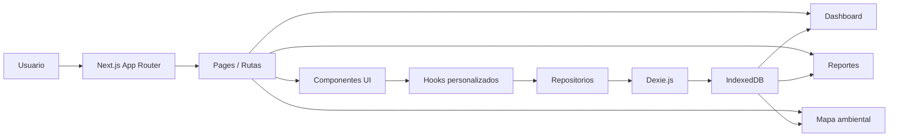
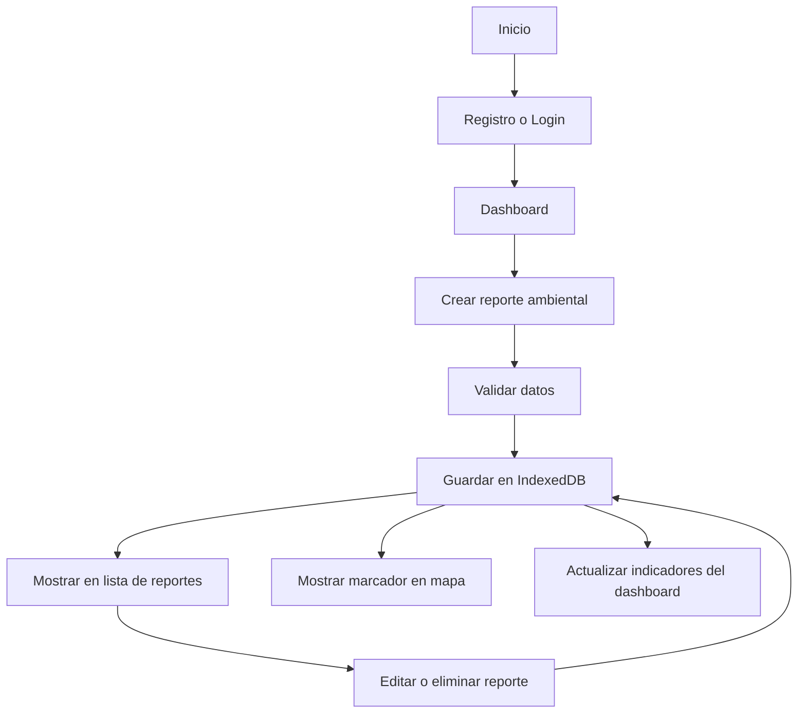
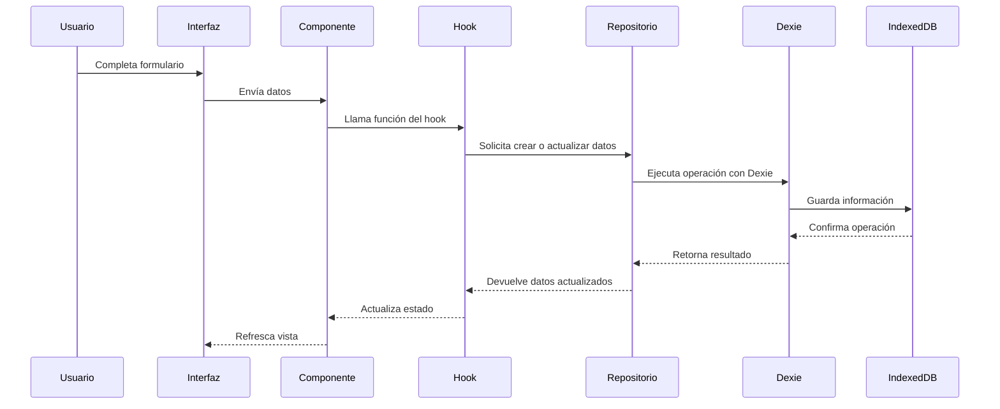
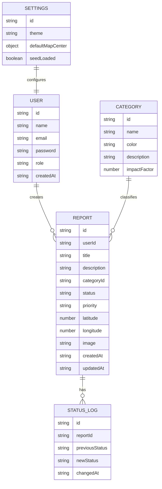
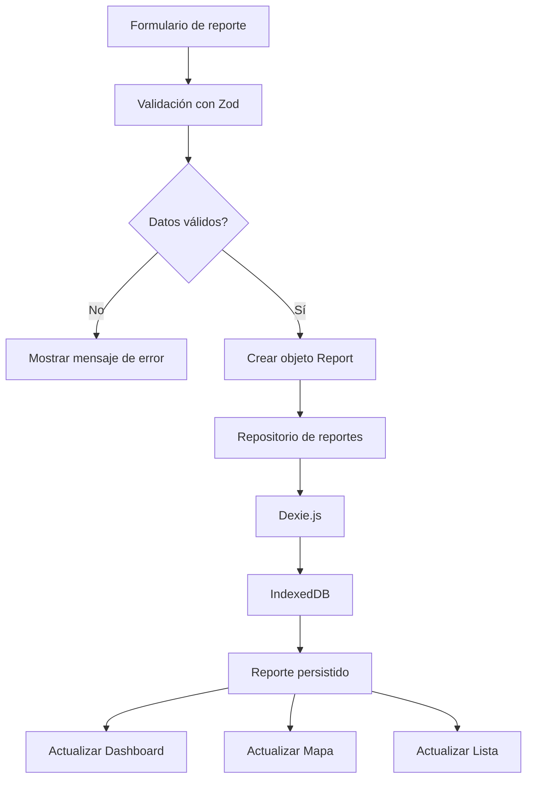
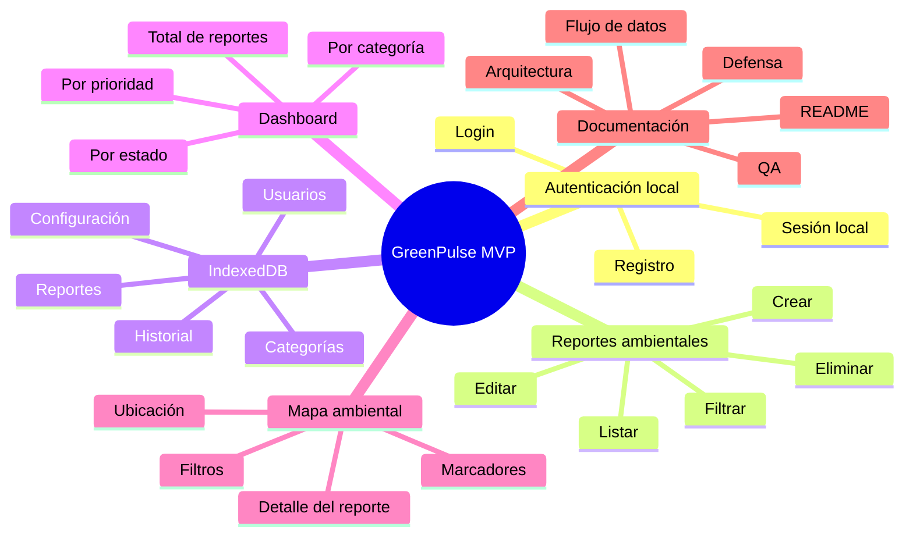
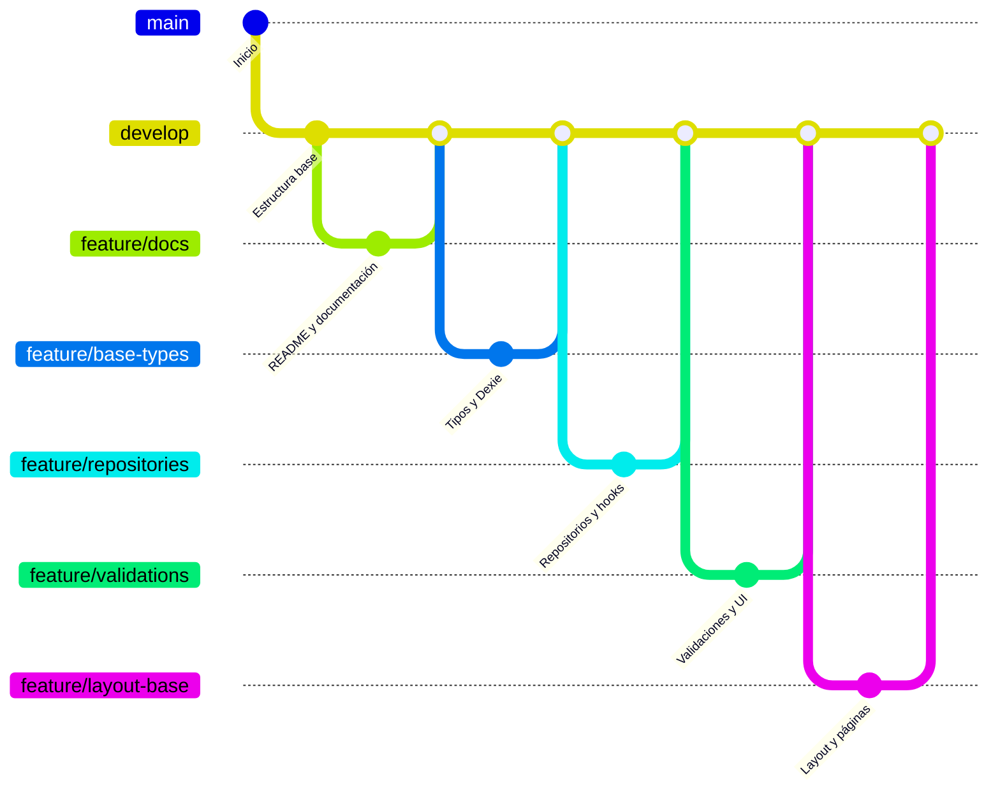
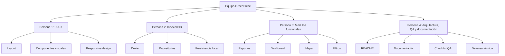

# Diagramas técnicos - GreenPulse

Este documento contiene los diagramas principales del proyecto GreenPulse. Su objetivo es facilitar la comprensión de la arquitectura, el flujo de datos, el modelo de almacenamiento local y la organización del desarrollo.

Los diagramas están escritos con sintaxis Mermaid, compatible con GitHub.

---

# 1. Diagrama de arquitectura general

## Explicación

La arquitectura de GreenPulse se organiza como una aplicación frontend moderna. El usuario interactúa con páginas de Next.js, estas páginas usan componentes reutilizables, los componentes se conectan con hooks personalizados, los hooks llaman a repositorios y los repositorios se comunican con Dexie para guardar o consultar datos en IndexedDB.

Esta organización permite separar responsabilidades y evitar que la lógica del sistema quede mezclada directamente en las pantallas.

---

# 2. Diagrama del flujo principal del usuario

## Explicación

El flujo principal inicia cuando el usuario entra al sistema, se registra o inicia sesión. Luego puede crear reportes ambientales. Cada reporte se valida y se almacena en IndexedDB. Después, el sistema actualiza la lista de reportes, el mapa ambiental y el dashboard.

---

# 3. Diagrama de flujo de datos

## Explicación

Este diagrama muestra cómo se mueve la información desde la acción del usuario hasta el almacenamiento local. La interfaz no se comunica directamente con IndexedDB, sino que pasa por componentes, hooks y repositorios. Esto mantiene el código más limpio y defendible.

---

# 4. Diagrama del modelo de datos

## Explicación

El modelo de datos se basa en cinco entidades principales:

* `User`: representa usuarios locales.
* `Report`: representa incidencias ambientales.
* `Category`: clasifica los reportes por tipo de problema.
* `StatusLog`: registra cambios de estado.
* `Settings`: guarda configuración inicial de la aplicación.

La entidad central es `Report`, porque conecta al usuario, la categoría, el mapa, el dashboard y el historial de estados.

---

# 5. Diagrama de persistencia local

## Explicación

Antes de guardar un reporte, el sistema debe validar los datos. Si los datos son correctos, se crea el objeto `Report` y se almacena mediante Dexie en IndexedDB. Luego, la información guardada se usa para actualizar las demás secciones del sistema.

---

# 6. Diagrama de módulos del MVP

## Explicación

El MVP de GreenPulse se enfoca en seis áreas principales: autenticación local, reportes, persistencia con IndexedDB, dashboard, mapa ambiental y documentación. Las funciones avanzadas como IA, IoT o predicción quedan como extras posteriores.

---

# 7. Diagrama de ramas en GitHub

## Explicación

La estrategia de ramas permite mantener el proyecto ordenado. La rama `main` se reserva para versiones estables, `develop` integra los avances del equipo y cada rama `feature` se usa para desarrollar una parte específica.

---

# 8. Diagrama de responsabilidades del equipo

## Explicación

Aunque el equipo puede apoyarse entre sí, cada persona tiene responsabilidades principales. Esta distribución ayuda a organizar el trabajo y facilita explicar quién desarrolló cada parte durante la defensa.

---

# 9. Uso de los diagramas en defensa

Durante la defensa técnica, los diagramas pueden usarse para explicar:

1. Cómo está organizada la arquitectura.
2. Cómo fluye la información.
3. Cómo se guardan los datos en IndexedDB.
4. Qué módulos forman el MVP.
5. Cómo se organizó el trabajo en GitHub.
6. Qué responsabilidad tuvo cada integrante.

Estos diagramas no reemplazan la explicación oral, pero sirven como apoyo visual para demostrar orden, planificación y dominio técnico.
